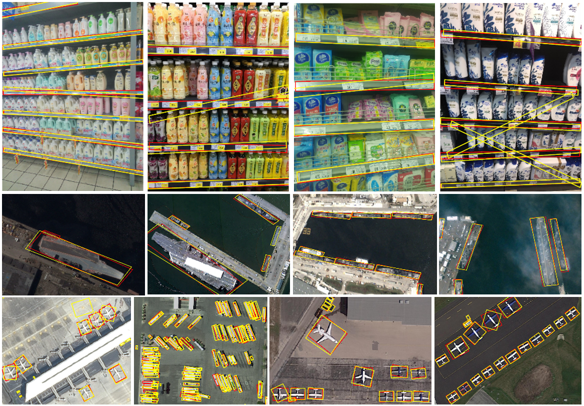

# PIoU Loss
Orientated Object Detection; IoU Loss

> [**PIoU Loss: Towards Accurate Oriented Object Detection in Complex Environments**](https://www.researchgate.net/publication/343054040_PIoU_Loss_Towards_Accurate_Oriented_Object_Detection_in_Complex_Environments),            
> Zhiming Chen, Kean Chen, Weiyao Lin, John See, Hui Yu, Yan Ke, Cong Yang

> *arXiv technical report ([arXiv:2007.09584](https://arxiv.org/abs/2007.09584))*         

## Abstract 

Object detection using an oriented bounding box (OBB) can better target rotated objects by reducing the overlap with background areas. Existing OBB approaches are mostly built on horizontal bounding box detectors by introducing an additional angle dimension optimized by a distance loss. However, as the distance loss only minimizes the angle error of the OBB and that it loosely correlates to the IoU, it is insensitive to objects with high aspect ratios. Therefore, a novel loss, Pixels-IoU (PIoU) Loss, is formulated to exploit both the angle and IoU for accurate OBB regression. The PIoU loss is derived from IoU metric with a pixel-wise form, which is simple and suitable for both horizontal and oriented bounding box. To demonstrate its effectiveness, we evaluate the PIoU loss on both anchor-based and anchor-free frameworks. The experimental results show that PIoU loss can dramatically improve the performance of OBB detectors, particularly on objects with high aspect ratios and complex backgrounds. Besides, previous evaluation datasets did not include scenarios where the objects have high aspect ratios, hence a new dataset, Retail50K, is introduced to encourage the community to adapt OBB detectors for more complex environments.

## Installation

The code was tested on Ubuntu 16.04, with [Anaconda](https://www.anaconda.com/download) Python 3.6 and [PyTorch]((http://pytorch.org/)) v0.4.1. NVIDIA GPUs are needed for both training and testing.
After install Anaconda:

1. Install pytorch1.3.1:

    ~~~
    conda install pytorch=1.3.1 torchvision -c pytorch
    ~~~

2. Install [COCOAPI](https://github.com/cocodataset/cocoapi):

    ~~~
    # COCOAPI=/path/to/clone/cocoapi
    git clone https://github.com/cocodataset/cocoapi.git $COCOAPI
    cd $COCOAPI/PythonAPI
    make
    python setup.py install --user
    ~~~

3. Install the requirements

    ~~~
    pip install -r requirements.txt
    ~~~

4. Compile 
    ~~~
    cd $CenterNet_ROOT/src/lib/models/networks/DCNv2
    ./make.sh
    ~~~
    ~~~
    cd $CenterNet_ROOT/src/lib/external
    make
    ~~~
    cd $CenterNet_ROOT/src/lib/piou_loss
    python setup.py install

## Training and Testing

1. Data pre-processing

    - retail50k2coco.py

2. Data-related parameters

    - retail50k.py
    
3. Training
    
    - ctrdet_retail50k_512.sh

4. Testing

    - retail50k_demo.py
    - retail50k_eval.py
    
## Results

## License
PIoU is released under the MIT License (refer to the LICENSE file for details). Portions of the code are borrowed from CenterNet. Please refer to the original License of this project.

## Citation

If you find this project useful for your research, please use the following BibTeX entry.

    @inproceedings{Yang2020PLT,
      title      = {PIoU Loss: Towards Accurate Oriented Object Detection in Complex Environments},
      author     = {Chen, Zhiming and Chen, Kean and Lin, Weiyao and See, John See and Yu, Hui and Ke, Yan and Yang, Cong},
      booktitle  = {European Conference on Computer Vision},
      pages      = {1-17},
      year       = {2020}
    }

# Retail50K Dataset

If you want to reproduce the results in the paper for benchmark evaluation and training, you will need to setup dataset. The original images and annotations are all stored in the csv files. You can easily convert them into different formats based on your requirements.  For example, retail50k2coco.py. Be noted that due to the size limitation in github, the training data is split into two csv files. You should use the training data from both files. 

## Training data

  ~~~
  ${CenterNet_ROOT}
  |-- retail50k
  `-- |-- retail50k_train1.csv
  `-- |-- retail50k_train2.csv
  ~~~

## Testing data

  ~~~
  ${CenterNet_ROOT}
  |-- retail50k
  `-- |-- retail50k_test.csv
  ~~~
